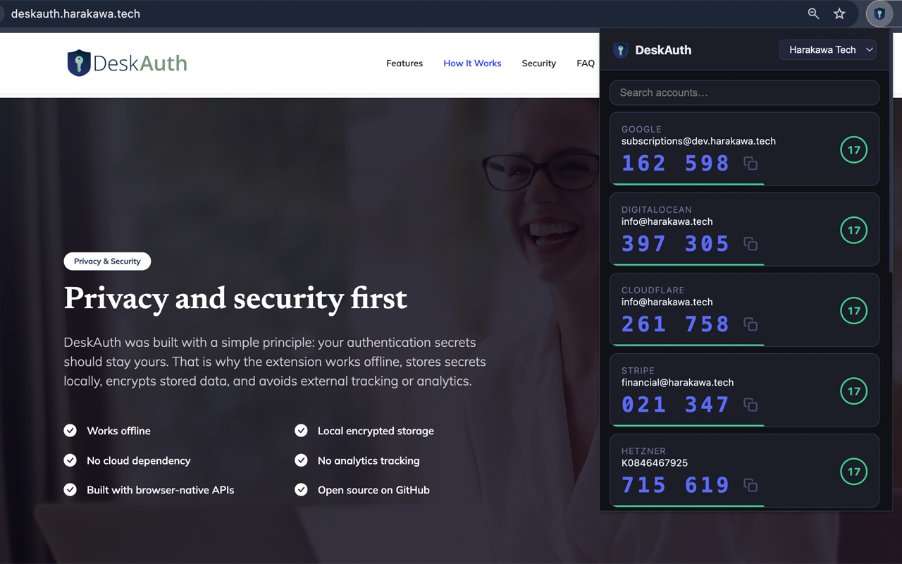

# DeskAuth — 2FA Authenticator for Desktop

> A lightweight Chrome Extension that brings your TOTP authentication codes to your desktop — fast, offline, and encrypted.
> Published by **[Harakawa Tech](https://deskauth.harakawa.tech/)**

<p align="center">
  
</p>

---

## Overview

DeskAuth is a Chrome Extension that generates **TOTP (Time-based One-Time Password)** codes — the same 6-digit codes used by Google Authenticator, Authy, and similar apps — directly inside your browser, without needing your phone.

**Core principles:**

- 🔒 **100% offline** — no external APIs, no analytics, no network requests
- 🔐 **Local encryption** — secrets encrypted with AES-256-GCM before storage; plaintext never touches disk
- 📦 **No external dependencies** — built entirely with browser-native APIs (Web Crypto, `chrome.storage`, ES modules)
- ✅ **Manifest V3** — built on the latest Chrome Extension platform

---

## Features

- Import accounts from **Google Authenticator** via QR code (camera or image file)
- Add accounts manually using a Base32 secret key
- Organize accounts into **profiles** for quick filtering
- **Search** across all accounts in real time
- Copy codes to clipboard with one click
- **Edit** and **delete** accounts
- Live countdown timer and progress bar per account
- Urgency indicators when codes are about to expire
- Available in **English**, **Spanish**, **Portuguese (Brazil)**, and **Portuguese (Portugal)**

---

## Loading the Extension (Developer Mode)

1. Clone or download this repository
2. Open Chrome and go to `chrome://extensions`
3. Enable **Developer mode** (toggle in the top-right corner)
4. Click **"Load unpacked"**
5. Select the folder containing `manifest.json`
6. The DeskAuth icon will appear in your Chrome toolbar

> After editing source files, click the refresh icon on the DeskAuth card at `chrome://extensions` to reload.

---

## Project Structure

```
DeskAuth/
│
├── manifest.json        Manifest V3 — permissions, icons, entry point
│
├── popup.html           Main popup UI
├── popup.css            Dark theme styles — account cards, modals, toasts
├── popup.js             UI controller — rendering, events, TOTP tick loop
│
├── totp.js              TOTP/HOTP engine — RFC 6238 / RFC 4226 (Web Crypto)
├── storage.js           Account CRUD — chrome.storage.local with encryption
├── crypto.js            AES-256-GCM + PBKDF2 encryption (Web Crypto)
├── qr-import.js         QR decoding + otpauth:// and otpauth-migration:// parsers
├── utils.js             Helpers — ID generation, clipboard, toast, Base32
│
├── camera.html          Standalone QR scanner tab
├── camera.js            Camera stream + frame scanning logic
│
├── _locales/
│   ├── en/              English (default)
│   ├── es/              Spanish
│   ├── pt_BR/           Portuguese (Brazil)
│   └── pt_PT/           Portuguese (Portugal)
│
├── icons/
│   ├── icon16.png
│   ├── icon32.png
│   ├── icon48.png
│   └── icon128.png
│
├── vendor/
│   └── jsqr.js          Bundled QR decoder (MIT — github.com/cozmo/jsQR)
│
└── icon_deskauth.png    Brand icon used in the popup UI
```

---

## Security

- Secrets are stored in `chrome.storage.local`, scoped exclusively to this extension
- All secrets are encrypted with **AES-256-GCM** before storage
- Encryption key is derived via **PBKDF2** (310,000 iterations, SHA-256) from a randomly generated IKM stored locally
- No data ever leaves the browser — no remote endpoints, no telemetry, no analytics
- Content Security Policy: `script-src 'self'; object-src 'self'`
- Permissions: only `storage` — no host permissions, no tab access

---

## Importing from Google Authenticator

1. Open **Google Authenticator** on your phone
2. Tap **⋮ → Transfer accounts → Export accounts**
3. Click **Scan** in DeskAuth and point your webcam at the QR code
4. All accounts are imported, encrypted, and saved locally

Multiple QR codes (for large account sets) are supported — DeskAuth will prompt you to scan each one in sequence.

---

## Author

Created by **Weslley Harakawa**, software engineer and founder of **Harakawa Tech**.

| | |
|---|---|
| 🌐 Website | [deskauth.harakawa.tech](https://deskauth.harakawa.tech/) |
| 📖 Documentation | [deskauth.harakawa.tech/help](https://deskauth.harakawa.tech/help) |
| 💼 LinkedIn | [linkedin.com/in/weslleyharakawa](https://www.linkedin.com/in/weslleyharakawa/) |
| 🐙 GitHub | [github.com/weslleyharakawa](https://github.com/weslleyharakawa/) |

---

## Support the Project

DeskAuth is free and open-source.
If it helps you, consider supporting its development:

☕ **[Buy Me a Coffee](https://buymeacoffee.com/weslleyaharakawa)**

---

## License

MIT License © 2026 Harakawa Tech
